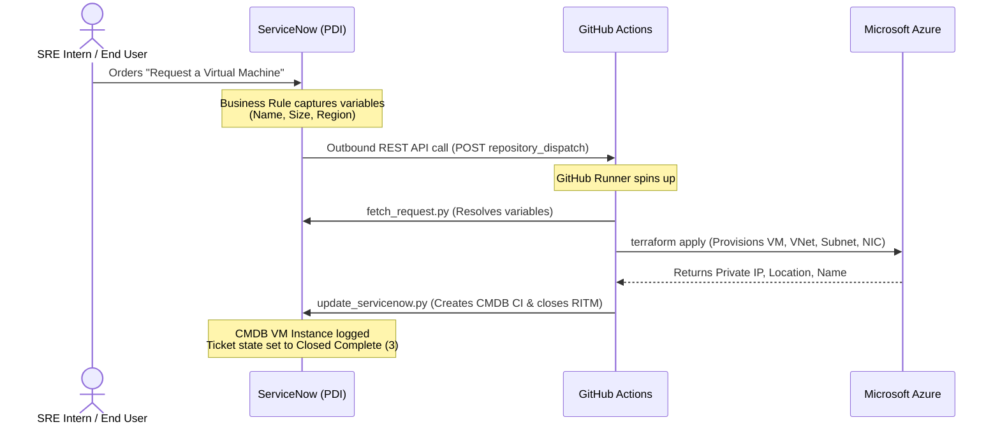
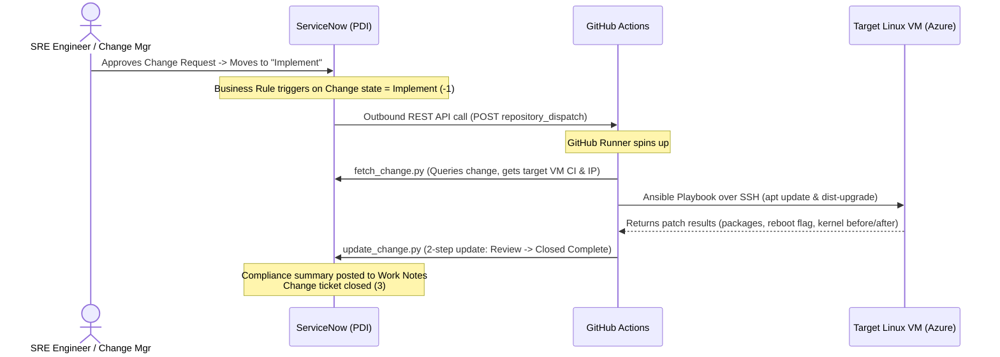

# SRE Intern Automation Project — Track A & Track B

This repository contains the complete infrastructure-as-code (IaC), configuration management, and integration glue for both **Track A: VM Provisioning** and **Track B: OS Patching** via ServiceNow.

Both tracks implement the **Golden Pattern** of automation: triggering cloud infrastructure and configuration runs from ServiceNow tickets, executing tasks via GitHub Actions, and writing compliance summaries back to ServiceNow.

---

## 📂 Project Directory Structure

```text
sre-intern-automation/
│
├── .github/
│   └── workflows/
│       ├── provision.yml              # Track A workflow (Terraform VM provisioning)
│       └── patch.yml                  # Track B workflow (Ansible OS patching)
│
├── track-A-vm-provisioning/           # Track A resources
│   ├── terraform/                     # Terraform IaC files (main.tf, variables.tf, outputs.tf)
│   └── scripts/                       # Python integration scripts (fetch_request.py, update_servicenow.py)
│
└── track-B-os-patching/               # Track B resources
    ├── terraform/                     # Terraform target VM with Public IP & SSH open
    ├── ansible/                       # Ansible playbook (patch.yml) & configuration (ansible.cfg)
    └── scripts/                       # Python integration scripts (fetch_change.py, update_change.py)
```

---

##  Track A — VM Provisioning via ServiceNow

Order a virtual machine in ServiceNow, trigger a GitHub Actions pipeline, provision resources in Microsoft Azure, update the ServiceNow Configuration Management Database (CMDB), and auto-close the Requested Item (RITM) ticket.

### Track A Architecture Flow



---

##  Track B — OS Patching via Ansible

Drive an OS patching run from a ServiceNow Change Request. When an approved Change Request transitions to the `Implement` phase, a pipeline uses Ansible over SSH to patch the target VM, write a patch compliance summary to the ticket, and close the change request.

### Track B Architecture Flow



---

